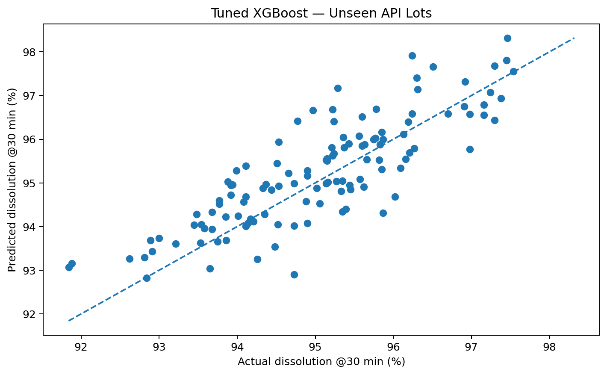
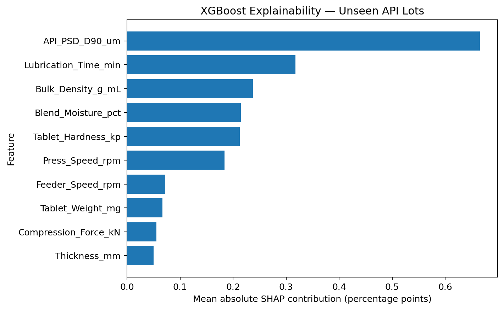

# Predictive CPV Analytics for Tablet Compression
## XGBoost Prediction, SHAP Explainability, and Applicability-Domain Control

**Version:** 1.0.0  
**Author:** Sri Harsha Chakrapani  
**Release date:** October 1, 2026  
**Status:** Synthetic proof of concept for education, portfolio, and research demonstration

> **Important scope statement:** This repository uses synthetic data. No proprietary manufacturing data are included. The model is **not validated for GMP use**, batch disposition, release testing, autonomous process control, or replacement of laboratory testing.

## Project overview

Traditional continued process verification (CPV) dashboards are primarily retrospective: they identify trends, statistical signals, shifts, or change points after data are generated. This project explores a controlled predictive extension.

The modeling question is:

> Can material, process, and in-process tablet attributes provide an explainable estimate of dissolution at 30 minutes for API lots not used in training, while also identifying conditions that are too unfamiliar for the prediction to be trusted?

The project combines:

- lot-aware model development and validation;
- simple baseline models before gradient boosting;
- tuned **XGBoost** regression;
- **SHAP** global and batch-level explainability;
- an applicability-domain check based on standardized nearest-neighbor distance; and
- explicit stress testing outside the model-development envelope.

The intended role is **engineering decision support**, not automated quality decision-making.

## Dataset design

The predictive dataset contains **720 synthetic tablet-compression batches across 18 synthetic API lots**.

| Split | Batches | API lots | Purpose |
|---|---:|---:|---|
| Training | 400 | 10 | Model fitting and grouped cross-validation |
| Validation | 120 | 3 unseen lots | Model selection and tuning assessment |
| Test | 120 | 3 unseen lots | Independent generalization assessment |
| Stress | 80 | 2 deliberately OOD lots | Applicability-domain and extrapolation stress test |

API lot identity is used for grouping and split design, not as a predictor.

Synthetic manufacture dates are simulation labels only; they do not represent real production records.

## Modeling workflow

```text
Synthetic manufacturing data
        |
        v
Lot-aware train / validation / test split
        |
        v
Baseline models
Linear Regression + Random Forest
        |
        v
Grouped XGBoost tuning
GroupKFold by API lot
        |
        v
Independent unseen-lot test
        |
        +--------------------+
        |                    |
        v                    v
SHAP explainability   Applicability-domain check
        |                    |
        +----------+---------+
                   v
     Controlled decision-support output
```

## Independent unseen-lot performance

Performance on the **120-batch independent test set from unseen API lots**:

| Model | MAE | RMSE | R² |
|---|---:|---:|---:|
| Linear Regression | 0.581 | 0.756 | 0.630 |
| Random Forest | 0.594 | 0.778 | 0.609 |
| **Tuned XGBoost** | **0.602** | **0.740** | **0.646** |

These results describe performance on the **synthetic dataset only**. They are not evidence of performance on a commercial pharmaceutical process.



## SHAP explainability

SHAP is used to explain model behavior rather than to claim mechanistic causality. The largest mean absolute SHAP values in this synthetic model were associated with:

| Feature | Mean absolute SHAP |
|---|---:|
| API PSD D90 | 0.666 |
| Lubrication time | 0.318 |
| Bulk density | 0.237 |
| Blend moisture | 0.215 |
| Tablet hardness | 0.213 |
| Press speed | 0.184 |

Feature importance reflects this model and this simulated dataset. It should not be interpreted as a validated CPP/CMA ranking or causal conclusion.



## Applicability-domain control

A predictive model will usually return a number even when a new observation is unlike the model-development data. This project therefore includes a standardized nearest-neighbor applicability-domain check.

| Dataset | N | OOD flagged | OOD rate |
|---|---:|---:|---:|
| Unseen-lot test | 120 | 13 | 10.8% |
| Deliberate stress set | 80 | 80 | 100.0% |

On the deliberately out-of-domain stress set, tuned XGBoost performance deteriorated to **RMSE 3.70** with a negative R². That failure is intentional and informative: it demonstrates why the model should not silently extrapolate beyond its learned operating space.

## Repository contents

| File | Purpose |
|---|---|
| `CPV_Project_V3_XGBoost_SHAP_Robust.ipynb` | Main reproducible notebook |
| `CPV_Predictive_Modeling_Synthetic_720.csv` | 720-batch lot-aware synthetic predictive dataset |
| `CPV_Synthetic_Source_Data.csv` | Original smaller synthetic CPV source dataset used in the notebook |
| `CPV_V3_Model_Performance.csv` | Validation, test, and stress-set model metrics |
| `CPV_V3_SHAP_Importance_Stability.csv` | Global SHAP importance and bootstrap stability |
| `CPV_V3_Worst_Batch_SHAP_Explanation.csv` | Example batch-level SHAP decomposition |
| `CPV_V3_Unseen_Lot_Test_Predictions.csv` | Batch-level independent test predictions |
| `CPV_V3_Applicability_Domain_Summary.csv` | OOD flag summary |
| `CPV_V3_SHAP_Global_Importance.png` | SHAP importance figure |
| `CPV_V3_Unseen_Lots_Actual_vs_Predicted.png` | Independent test-set performance figure |
| `Predictive_CPV_XGBoost_SHAP_Project_Report_v1.0.docx` | Detailed professional project report |
| `CITATION.cff` | GitHub citation metadata |
| `.zenodo.json` | Zenodo-specific release metadata |
| `ZENODO_METADATA.md` | Human-readable Zenodo upload text |
| `RELEASE_NOTES.md` | V1.0 release notes |
| `requirements.txt` | Python package requirements |

## Running the notebook

1. Clone or download the repository.
2. Create a Python environment.
3. Install the requirements:

```bash
pip install -r requirements.txt
```

4. Launch Jupyter:

```bash
jupyter notebook
```

5. Open `CPV_Project_V3_XGBoost_SHAP_Robust.ipynb`.
6. Run the notebook from the repository root so the existing relative file paths resolve correctly.

## Design principles demonstrated

This project intentionally emphasizes more than model accuracy:

- **Leakage prevention:** API lots are kept together during split and grouped cross-validation.
- **Baseline comparison:** complex modeling is compared with simpler alternatives.
- **Unseen-group testing:** final evaluation uses API lots excluded from training.
- **Explainability:** SHAP supports interrogation of global and batch-level model behavior.
- **Model-boundary awareness:** predictions outside the development envelope are flagged.
- **Human oversight:** predictions support engineering judgment rather than replace it.
- **Transparent limitations:** synthetic performance is clearly separated from real-world GMP validation.

## Limitations

- All 720 predictive observations are synthetic.
- The use case represents one simulated immediate-release tablet process.
- The feature set is illustrative and is not a validated CPP/CMA set.
- SHAP explains model behavior but does not establish causality.
- The nearest-neighbor applicability-domain method is a proof-of-concept control.
- Uncertainty estimates are illustrative rather than formally calibrated.
- No prospective manufacturing deployment, data-integrity qualification, computerized-system validation, or model-lifecycle SOP has been performed.

## Suggested next development stages

A real-world development program would require appropriately permissioned/de-identified process data, predefined acceptance criteria, temporal and lot-aware validation, calibrated uncertainty, drift monitoring, controlled model lifecycle procedures, and prospective silent-mode testing before any limited operational decision-support use.

## Citation

Until a Zenodo DOI is minted, cite the V1.0 software release using the citation information in `CITATION.cff` or `CITATION.txt`.

After Zenodo publishes the release, update this README and `CITATION.cff` with the version-specific DOI.

## License

This project is released under the MIT License. See `LICENSE`.
